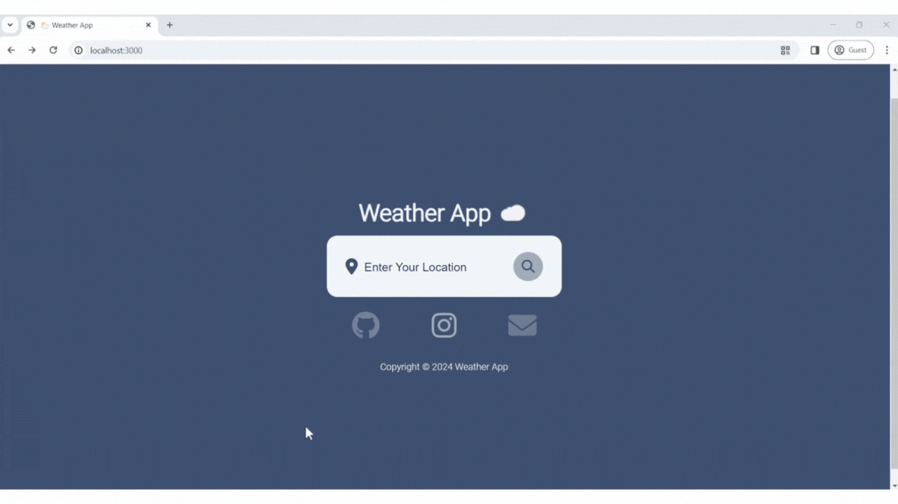
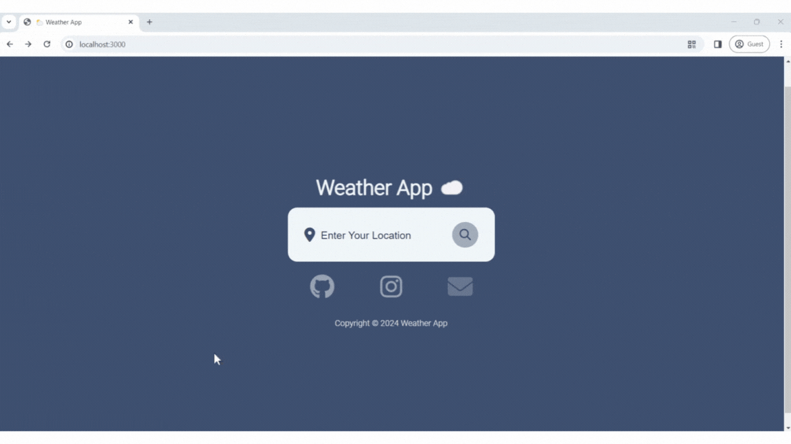
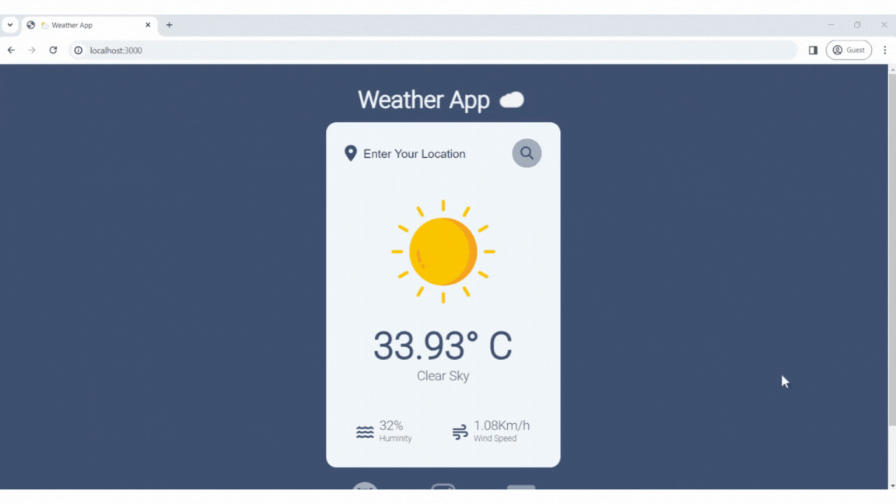
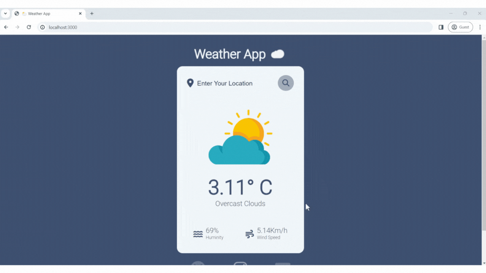

# Weather App
## Try Damo
**You can try out the website at this link :** **https://weather-apps-md9j.onrender.com/**

## About the website
This website is a study of how to use JavaScript with external APIs only. It is not intended to be used for any illegal purposes. However, I would like to thank openweathermap for making this project possible. For more information about the website, you can visit this link: **https://openweathermap.org/**

## How to use and what you need
* The index.js file uses two main libraries:
    * **Express**: a library that opens the server
    * **BodyParser**: a library that stores user input
      
* To try out the website, you will need the following:
    * **Node.js**
    * **Node Package Manager** (NPM)
    * **API** (You need to subscribe to the openweathermap website to get the API)
  
## Basic usage
1. After installing Node.js, open a terminal and install NPM using the command `npm i`.
2. Copy the API you received from **openweathermap** and paste it into the `API_Key` variable in `index.js`.
3. Start the server using the command node `index.js.` If the server starts successfully, you will see the message "**Server running on port 3000**".
4. After starting the server, access the website at the URL: `http://localhost:3000/`.
5. To close the server, press **`Ctrl+C`**.

## Introduction to the website
This website is about creating a website that allows users to check the weather. Users can enter the country they want to check the weather for. The output will include information about the weather, humidity, and wind speed at the current time. The details are in the next section.

## Website details
When you open the website, this window will appear. Users can enter information in the search bar to search for the desired weather or contact the website creator by clicking on the image below the website.

When users successfully find the weather, the following information will appear, including the weather, weather description, humidity, and wind speed.

When users want to search for the weather of another country at the current time

This page will appear when users mistype or type incompletely.

### Postscript
Finally, I would like to thank **OpenWeatherMap** again for making this project possible. This is my first time writing a website using an API. If there are any errors, please feel free to explain them to me. I will take them into account in my next project. Thank you.

